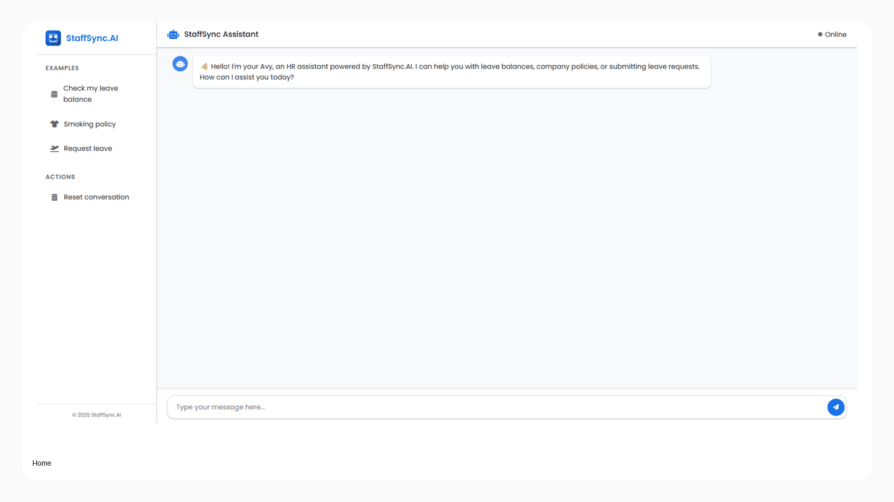

# StaffSync.AI

StaffSync.AI is a lightweight HR assistant that lets employees:

- check **leave balances**
- **submit leave requests** (auto-routed to their lead for **email approval by Y/N reply**)
- **search HR policies** from your own document vault (RAG over PDFs/TXTs)

It ships with a minimal web UI, OTP-based authentication, Google Sheets for data, and a ChromaDB-backed policy index. You can run with a **local LLM** (e.g., *Llama 3.1 8B Instruct, 4‑bit quantized*) or fall back to OpenAI.

---

## Table of Contents

- [Features](#features)
- [Architecture](#architecture)
- [Project Structure](#project-structure)
- [Prerequisites](#prerequisites)
- [Environment Variables](#environment-variables)
- [Google Sheets Setup](#google-sheets-setup)
- [HR Policy Search (RAG) Setup](#hr-policy-search-rag-setup)
- [Install & Run](#install--run)
- [API](#api)
- [Validation, Guardrails & Retries](#validation-guardrails--retries)
- [Local LLM Notes & Hardware](#local-llm-notes--hardware)
- [Email Approvals (Y/N)](#email-approvals-yn)
- [Monitoring & Logs](#monitoring--logs)
- [Troubleshooting](#troubleshooting)
- [Screenshots](#screenshots)
- [Roadmap / Future Improvements](#roadmap--future-improvements)
- [Suggestions & Nice-to-haves](#suggestions--nice-to-haves)
- [Contributing](#contributing)
- [License](#license)

---

## Features

- **Chat UI + OTP flow**  
  Single-page UI served by Flask. Privileged actions (e.g., creating a leave request) trigger an **OTP modal** and `/api/verify-otp` flow.

- **Function-calling tools**  
  The assistant can call:
  - `get_employee_balance(employee_id)`
  - `add_leave_log(employee_id, leave_type, days, start_date, end_date)`
  - `file_search(query_text)` → searches your HR policy vault (ChromaDB).

- **Google Sheets backend**  
  Service-account authenticated access to three sheets: *Leaves Balance*, *Employee Directory*, *Leaves Logs*.

- **Email approvals (reply Y/N)**  
  Leads receive email with request details and simply reply **Y** or **N**. An IMAP watcher processes the decision, updates the log (and balances), and emails the employee.

- **Local LLM or OpenAI**  
  If `HF_MODEL_ID` is set, the app loads a local model; otherwise it uses OpenAI. Both paths share the same tool/validation layer.

- **Optional ngrok** for quickly exposing a public URL in dev.

---

## Architecture

```
Browser UI (templates/index.html, static/js/chat.js, static/css/styles.css)
        |
        v
     Flask API (src/app.py)
      ├── /api/chat         -> invokes model; may return tool calls or require_auth
      └── /api/verify-otp   -> verifies code and replays pending tool call
        |
        ├── Tools (src/utils.py) ───────► Google Sheets (balances, directory, logs)
        |                                 └─ service account auth (src/sheets_config.py)
        ├── Policy RAG (src/hr_policy_vault.py) ─► ChromaDB (vector index of PDFs/TXTs)
        ├── Auth (src/core/auth.py) ──► SMTP OTP send + expiry
        ├── Auth middleware (src/core/auth_middleware.py) ─► pending calls, user mapping
        └── Model (src/models.py) ───► local HF or OpenAI, with repair/retry loop
```

**Validation** lives in `src/validation.py` (Pydantic models) and is applied before any tool executes.

---

## Project Structure

```
src/
  core/
    auth.py              # OTP issue/verify + SMTP helpers
    auth_middleware.py   # map sessions->employee, hold pending tool calls
  static/
    css/styles.css
    images/logo.svg
    js/chat.js           # chat UX + OTP modal + session storage
  templates/
    index.html           # single page app
    __init__.py
  app.py                 # Flask app + endpoints + ngrok bootstrap (optional)
  constants.py           # system prompts, tool schemas, email HTML templates
  hr_policy_vault.py     # load policies -> chunk -> embed -> ChromaDB; query top-k
  models.py              # local HF or OpenAI runner + retry/repair on bad outputs
  sheets_config.py       # gspread/Google auth + open specific sheets
  utils.py               # tool implementations + email bodies + helper functions
  validation.py          # Pydantic models for tool args & assistant output
  watch_inbox.py         # IMAP watcher that applies Y/N approvals
__init__.py
.env.example
requirements.txt
```
---

## Prerequisites

- **Python** 3.10+
- **Google Cloud** service account JSON with Sheets scope (shared to your 3 spreadsheets)
- **Email** account that can send mail (Gmail/Outlook/Yahoo supported; use *App Passwords*)
- **OpenAI key** (if not using local model)
- *(Optional)* **GPU** for local model

---

## Environment Variables

Create a `.env` (copy from `.env.example` if present).

```ini
# Model selection
OPENAI_API_KEY=sk-...                 # required if not using local model
HF_MODEL_ID=meta-llama/Meta-Llama-3.1-8B-Instruct-GGUF   # example; any local ID

# Google Sheets
GOOGLE_APPLICATION_CREDENTIALS=/abs/path/to/service-account.json

# Policy vault (RAG)
POLICIES=./policies/handbook.pdf,./policies/leave_policy.txt

# Email (sending OTP & notifications)
EMAIL_SENDER=your-address@gmail.com
EMAIL_PASSWORD=your-app-password      # use App Passwords for Gmail/Outlook/Yahoo
# IMAP (optional override; auto-detected by domain if omitted)
EMAIL_IMAP_SERVER=imap.gmail.com
EMAIL_IMAP_PORT=993

# Ngrok (optional)
NGROK_AUTH_TOKEN=xxxxxx
NGROK_PATH=/custom/path/to/ngrok      # optional
```

> Notes
> - If `HF_MODEL_ID` is set, the server prefers local LLM. If not, it uses OpenAI.
> - OTP emails use SMTP; IMAP is used by the watcher to parse Y/N replies.
> - `POLICIES` can list any number of .pdf or .txt files (comma-separated).

---

## Google Sheets Setup

Create **three** spreadsheets and share them with your service account email:

1. **StaffSync.AI - Leaves Balance**  
   Columns: `Employee ID`, `Annual Leave`, `Sick Leave`, `Casual Leave`

2. **StaffSync.AI - Employee Directory**  
   Columns: `Employee ID`, `Name`, `Email`, `Lead`

3. **StaffSync.AI - Leaves Logs**  
   Columns: `Request ID`, `Employee ID`, `Employee Name`, `Leave Type`, `Days`, `Start Date`, `End Date`, `Status`, `Submitted At`, `Approved By`, `Approval Date`

> The app opens these by **name** and uses the **first worksheet**.

---

## HR Policy Search (RAG) Setup

- Place your policy PDFs/TXTs on disk and point `POLICIES` to them.  
- On startup, `src/hr_policy_vault.py` loads & chunks the files and embeds them into a **ChromaDB** collection. Subsequent starts reuse the index unless content changes.

---

## Install & Run

```bash
# 1) Install
pip install -r requirements.txt

# 2) Configure
cp .env.example .env   # if available
# then fill in the values described above

# 3) Start the web app
python -m src.app
# -> UI available at http://127.0.0.1:5000  (ngrok URL will be printed if configured)
```

---

## API

### `POST /api/chat`
Send a user message; the server maintains session context and either returns a text reply or asks you to verify via OTP when an action requires it.

**Request**
```json
{ "message": "Book annual leave 2025-09-02 to 2025-09-04", "session_id": "optional-uuid" }
```

**Response**
```json
{
  "message": "…assistant text…",
  "require_auth": false,
  "session_id": "generated-or-passed-through"
}
```

Special debug messages (dev only):
- `"debug_auth"` → shows current auth mapping for your session
- `"reset_all"` → clears session/pending calls/auth state

### `POST /api/verify-otp`
Verifies a 6-digit code and **replays any pending tool call** that required auth.

**Request**
```json
{ "otp": "123456", "session_id": "..." }
```

**Response**
```json
{ "success": true, "message": "Authentication successful! ..." }
```

---

## Validation, Guardrails & Retries

- **Pydantic-first tool schemas** (`src/validation.py`) strictly validate:
  - `employee_id` must be present & well-formed
  - `leave_type` ∈ {Annual, Sick, Casual} (extensible)
  - `days` is a positive number; `start_date <= end_date`
  - `file_search` input is a non-empty string
- **Auth middleware** gates sensitive tools; if the user is unauthenticated (or tries to act on *another* employee’s data), the server triggers **OTP** and stores a **pending call** against the session (`src/core/auth_middleware.py`). On `POST /api/verify-otp`, the call is resumed.
- **Local-LLM repair & retries** (`src/models.py`):
  - Model output is parsed for *tool calls or content*. If JSON is malformed or missing required fields, a **repair prompt** is injected and the model is **retried** (default: up to **3 attempts**).
  - Only **validated** tool calls are executed; otherwise the user sees a helpful error with next steps.
- **Sheets & email operations** use defensive checks and return structured error messages to the UI.

These guardrails keep the app stable even when local models occasionally produce imperfect JSON/tool outputs.

---

## Local LLM Notes & Hardware

- **Recommended (tested):** *Llama 3.1 8B Instruct, 4‑bit quantized.*  
  This configuration delivers solid interactive performance for StaffSync.AI’s tool-routing needs and requires **~8 GB VRAM**. Verified on an **RTX 3070**.
- If `HF_MODEL_ID` is **unset**, OpenAI is used.
- Keep outputs short; prefer letting tools do the heavy lifting. The **retry/repair loop** already handles occasional JSON issues for local models.

> You can always switch between local and OpenAI by setting/unsetting `HF_MODEL_ID` in `.env`.

---

## Email Approvals (Y/N)

1. When an employee submits a leave request, their **lead** receives a **styled email** with full request details.
2. The lead replies with **Y** (approve) or **N** (reject) as the **first visible line** of the reply.
3. `src/watch_inbox.py` (run as a separate process) polls IMAP, reads the decision, **updates the Logs sheet**, adjusts balances on approval, and emails the employee the result.

---

## Monitoring & Logs

- The Flask server logs request/response summaries and ngrok URL (if enabled).
- The IMAP watcher logs decisions and sheet updates.
- Add your favorite process runner (e.g., `honcho`, `tmux`, `pm2`) for multi-process dev convenience.

---

## Troubleshooting

- **`OPENAI_API_KEY is not set`** → Set it in `.env` when not using local model.
- **`GOOGLE_APPLICATION_CREDENTIALS not set`** → Provide absolute path to service-account JSON.
- **Gmail SMTP auth error** → Use an **App Password** and ensure “2‑Step Verification” is enabled.
- **Policies not loaded** → Ensure `POLICIES` points to existing .pdf/.txt files.
- **IMAP not connecting** → Set `EMAIL_IMAP_SERVER`/`EMAIL_IMAP_PORT` explicitly for custom domains.
- **Ngrok not starting** → Install `pyngrok` and/or set `NGROK_PATH`; verify token.

---

## Screenshots


---

## Roadmap / Future Improvements

- **Model fine‑tuning** for your HR tone, tool-call traces, and policy style.  
- **Smaller fine‑tuned models** (3B–4B) to reduce GPU/RAM overhead while keeping accuracy for this domain.
- **Analytics dashboard** track employee interactions & common queries.
- **Improve RAG** add multi-source HR knowledge ingestion (PDFs, Confluence, SharePoint).
- **Voice assistant integration** to allow natural speech HR queries.
- **Role-based access control** (RBAC) for managers vs employees.
---

## Contributing

1. Fork and create a feature branch.  
2. Keep changes small and add basic tests (validation, tool-call parsing).  
3. Lint/format, then open a PR.

---

## 📝 License

This project is licensed under the MIT License. See the [LICENSE](LICENSE) file for details.

## 🙋‍♂️ Author

[GitHub: @SameedHusayn](https://github.com/SameedHusayn)
